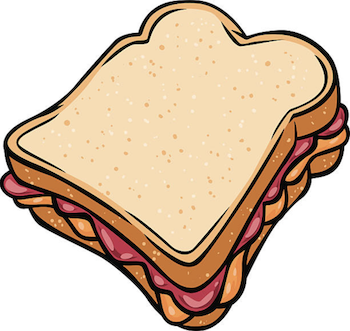

::::::::::::::::::::::::::::::::::::::: objectives

- Learn about some of the unconscious biases that are apparent when writing documentation.
- Become familiar with practices that have been empirically shown to improve software documentation, both in process and end product.

::::::::::::::::::::::::::::::::::::::::::::::::::

:::::::::::::::::::::::::::::::::::::::: questions

- How does bias affect documentation?
- What are better practices for software documentation?

::::::::::::::::::::::::::::::::::::::::::::::::::

:::::::::::::::::::::::::::::::::::::::  challenge

## Let's make a sandwich

We are going to make a nut butter and jelly sandwich.

* Write instructions for making this sandwich.
* Trade instructions with another participant and read each others'.
* How clear are the instructions? What are the strengths and weaknesses?

::::::::::::::::::::::::::::::::::::::::::::::::::

## Bias in Documentation

{alt='Getty Images - a image displaying a cartoon rendition of a peanut butter and jelly sandwich'}

You have now told your partner how to make a sandwich. Have you ever done that before?
Maybe you told them the steps:

1. Get two slices of bread
1. Spread condiments on the bread
1. Put the slices together

These steps may seem clear to you, but you have the benefit of context. You
know what a sandwich is. You've eaten one before. You may have even made
one before. As a result, you are able to fill in the logical gaps that
someone who has never seen or eaten a sandwich might not know.

You must be thoughtful when writing your documentation. In particular, it is
important to consider:

- *Culture*: You are an end product of your culture. Your culture provides you with a common understanding, common language, and more. Avoid slang/colloquialisms (e.g., "spaghetti code"), use clear and concise language, and consider how your audience's culture may differ from your own.
- *Context*: What does "workflow" mean? That depends on your context. Different domain sciences may use the same words in different contexts. Be cautious of this and ensure that your audience is aware of your domain's particular language and context.
- *Experience*: People are different, and their experiences are different. Your documentation should also take that into account. Design your documentation to match the experience level you expect of your audience, and _note that in the documentation_!

## Documentation Better Practices

There is no one-size fits all process for documentation. Instead, use this
as a guide for some better practices that may help your project.

1. _Version control your documentation_: Especially if your documentation is separate from your code repository, it is imperative to version control your official documentation. This can help you track the changes over the time, revert, find trends, etc., much like you would do with source code.
1. _Good enough is better than perfect_: Documentation takes a lot of time, and there will always be room for improvement. It is always better to have good enough documentation than to get stuck in endless discussions and iterations to try to make it "perfect." It can always be updated if need be later.
1. _Less is more_: More documentation means more technical debt. It's a good practice to minimize your documentation to what you actually need. The less documentation you have, the more time you have to make that documentation better. As your project grows, that may mean your set of documents grows. You should always aim, however, to have just the right amount. If you have an established project that seems like it has a _lot_ of unnecessary documentation, consider flagging documents for removal.
1. _Know your audience_: Who is supposed to use this documentation? What level of knowledge do they have? Answering these questions will help you anticipate questions and help needed.
1. _Document as you go_: It can be difficult to go back and write documentation a day later. It's even more difficult to try to do it a month later. It is recommended that documentation updates happen as part of your regular work so it's fresh in your mind and can help inform your development path.
1. _User test your documentation_: A great way to keep your documentation current and accurate is to regularly use it. This, however, goes back to the sandwich idea - you may have a bias and fill in the gaps that you consider to be "obvious." Instead, have a new team member try to use the documentation. For every question they have or barrier they hit, make an adjustment to that section of the document.

:::::::::::::::::::::::::::::::::::::::  challenge

## Let's make a sandwich... again

Try this exercise again. We want to make a nut butter and jelly sandwich.

* Write instructions to make this sandwich.
* Partner with the same participant as before.
* Discuss: What changes did you make?

::::::::::::::::::::::::::::::::::::::::::::::::::

:::::::::::::::::::::::::::::::::::::::: keypoints

- It is important to be aware of potential unconscious biases when writing documentation. Make sure to consider culture, context, and experience.
- No single practice will fit all software projects, but there are some generally better practices: version control, less is more, know your audience, document as you go.

::::::::::::::::::::::::::::::::::::::::::::::::::

