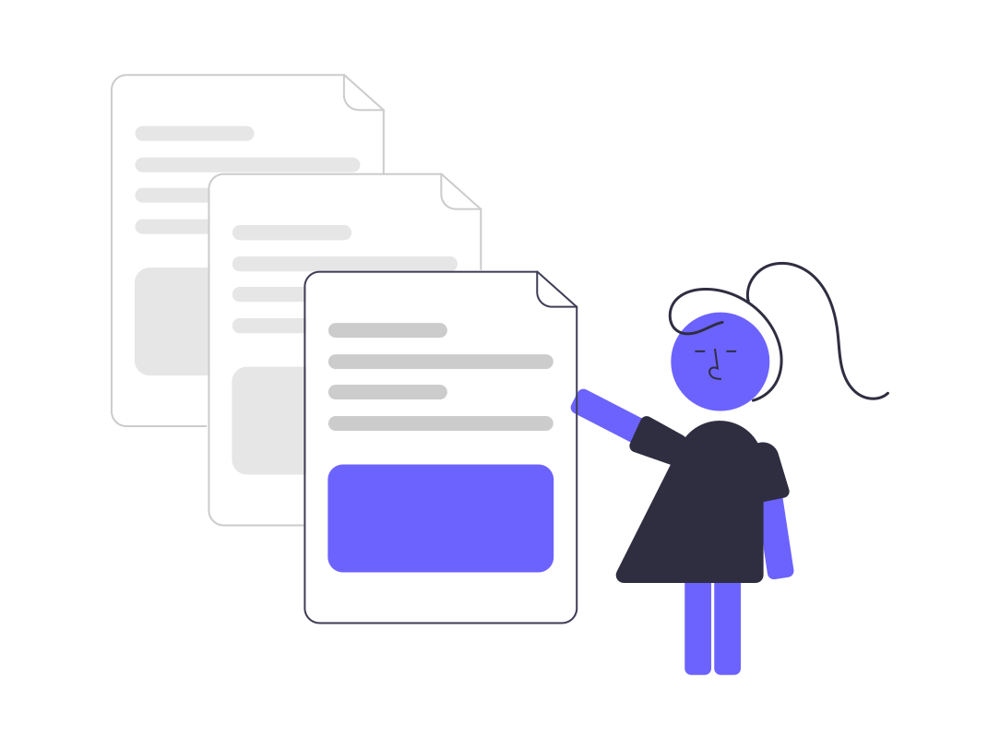

::::::::::::::::::::::::::::::::::::::: objectives

- Become familiar with the benefits and challenges of software documentation.

::::::::::::::::::::::::::::::::::::::::::::::::::

:::::::::::::::::::::::::::::::::::::::: questions

- What is software documentation?
- Why do we care about it?
- What are the challenges?

::::::::::::::::::::::::::::::::::::::::::::::::::

## Software Documentation Overview

Software documentation, per Forward, is any artifact made as part of the
software development process that is intended to communicate information
about the software system about which it was written.

{alt='Decorative Undraw.co image of three documents'}

Most people are familiar with this concept and know good documentation when
they see it. More difficult, however, is how to _write_ good documentation.

In this lesson, students will learn about the different types of software
documentation, plus the practices and tools that enable better documentation.

## The Benefits of Good Documentation

No one would argue that documentation isn't useful. The payoffs:

| Benefit | Why it matters |
|---------|----------------|
| **Better maintainability** | Clarifies what each part of the code does, making it safer and easier to change. |
| **Improved team productivity** | Gets everyone on the same page and brings new members up to speed faster. |
| **Increased code quality** | Writing down what code *should* do surfaces inconsistencies and prompts refactoring. |

## The Challenges to Making Good Documentation

...but documentation isn't easy. The common obstacles:

| Challenge | What it looks like |
|-----------|--------------------|
| **Time** | It competes with feature work, and falls out of date as interfaces change (technical debt). |
| **Skill** | Writing clearly is genuinely hard and takes practice — it's easy to get discouraged. |
| **Process** | Without a habit or workflow, documenting feels "clunky" and like wasted effort. |

::::::::::::::::::::::::::::::::::::::::::  callout

## Where does genAI fit?

Generative AI (LLMs like ChatGPT and Claude) is changing this practice. It can draft a
docstring, a README, or a tutorial in seconds — which knocks down the **time** and **skill**
barriers above. But cheap first drafts shift the real work from *writing* to **reviewing**:
the human still has to verify that what the AI wrote is *correct*. We'll return to this
thread throughout the lesson.

::::::::::::::::::::::::::::::::::::::::::::::::::::::

:::::::::::::::::::::::::::::::::::::::  challenge

## What do you think of this documentation?

Navigate to [https://spack.readthedocs.io/en/latest/](https://spack.readthedocs.io/en/latest/)
and spend a minute browsing the documentation.

* What makes this good documentation?
* Where is there room for improvement?

::::::::::::::::::::::::::::::::::::::::::::::::::

:::::::::::::::::::::::::::::::::::::::: keypoints

- Software documentation provides both users and developers information about what a software is supposed to do.
- Software documentation has numerous benefits including improved team productivity, increased code quality, and better maintainability.
- Software documentation can be challenging due to cost and time to maintain.

::::::::::::::::::::::::::::::::::::::::::::::::::

