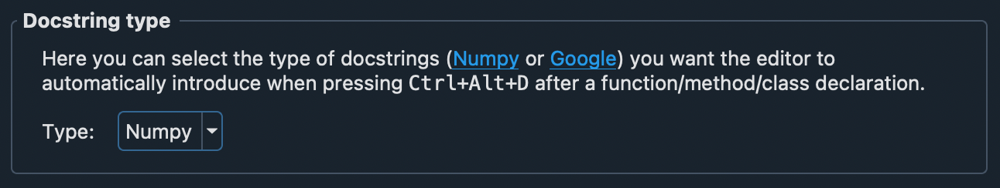

::::::::::::::::::::::::::::::::::::::: objectives

- Become familiar with categories of tools to streamline documentation processes.
- Practice using a small subset of documentation tools.

::::::::::::::::::::::::::::::::::::::::::::::::::

:::::::::::::::::::::::::::::::::::::::: questions

- What tools enable better documentation?
- What tools can streamline the documentation process?

::::::::::::::::::::::::::::::::::::::::::::::::::

## Documentation Tools

There are plenty of tools to make documentation easier. In this episode,
we will cover just a few, but keep in mind, this is by no means an
exhaustive list.

### Style Guides and Standards

A good first step to streamline the documentation process is to create
or apply an existing style guide. This is useful both for developer
and user documentation.

For users, common standards and styles makes
the documentation predictable, consistent, and easier to read and use.
For developers, common standards and styles allow developers to focus more
on logic than styling and makes fewer ambiguities and increases the chance
that they will identify errors.

There is no single standard across all languages and projects. Some language
style guides have specific recommendations for in-line documentation like code comments and API documentation
(e.g., [Doxygen](https://www.doxygen.nl/), [Google](https://google.github.io/styleguide/),
[NumPy](https://numpydoc.readthedocs.io/en/latest/format.html#docstring-standard)).

:::::::::::::::::::::::::::::::::::::::  challenge

## PRACTICE: Google Style for Euler's Method

Google has many style guides, including a Python guide for
[writing docstrings](https://google.github.io/styleguide/pyguide.html#38-comments-and-docstrings).

Using the Google style guide, write a docstring for the following class and its methods:

```python
class EulersMethod:
   def deriv(self, x, y):
       return y**2 + y*x + x**3
   def approx(self, y, x, h):
       y_j = y + h*self.deriv(x, y)
       x_j = x + h
       return y_j, x_j
```

::::::::::::::::::::::::::::::::::::::::::::::::::


### IDEs

Modern integrated development environments (IDEs) combine text editing with tools like
building, testing, and — usefully here — **docstring generation**. Popular options include
[VSCode](https://code.visualstudio.com/), [PyCharm](https://www.jetbrains.com/pycharm/),
[NetBeans](https://netbeans.apache.org/), and [Eclipse](https://www.eclipse.org/ide/); most
support many languages via extensions.

Many incorporate documentation generators that follow standard style guides. For example, the
[Spyder IDE](https://www.spyder-ide.org/) will present the framework for a docstring in your chosen style:

{alt='Spyder IDE docstring settings - dropdown includes different types of docstrings; NumPy style is selected'}

::::::::::::::::::::::::::::::::::::::::::  callout

## GenAI-powered assistants

The newest tools in this category are AI coding assistants (GitHub Copilot, Cursor, and the
docstring features now built into many IDEs). They can draft a docstring or comment from your
code in one keystroke. Two caveats carry over from earlier:

- **Verify it.** The assistant infers intent from code — it can describe behavior the code
  doesn't actually have. You own the review.
- **Mind the data.** For research code, check your group's and tool's policy before sending
  unpublished or sensitive code to a third-party service.

:::::::::::::::::::::::::::::::::::::::::::::::::::

### Automated Generation

Another set of tools that streamline the documentation process are those that
automatically generate the documentation within your software package. The two
most popular documentation generators are:

1. [Doxygen](https://www.doxygen.nl/)
1. [Sphinx](https://www.sphinx-doc.org/en/master/)

Both of these tools will generate documentation, per configuration preferences,
and automatically integrate information like API documentation.

:::::::::::::::::::::::::::::::::::::::  challenge

## PRACTICE: Trying out Sphinx

We will quickly practice getting Sphinx set up on a project.

_NOTE_: These steps assume you are working from the command line and
have a clone of your practice repository.

0. (OPTIONAL, but recommended) Make a virtual Python environment
```bash
# MacOS/Linux
python -m venv virtual-python
source virtual-python/bin/activate
# Windows
python -m venv virtual-python
virtual-python\Scripts\activate
```
1. Install sphinx: `pip install sphinx`
2. Move to your practice directory: `cd /path/to/your/practice/repository`
3. Make and move to a document directory: `mkdir docs && cd docs`
4. Run Sphinx's quickstart: `sphinx-quickstart`
   (_NOTE_: Use default options as applicable; fill out everything else as you desire.)
5. Generate the documentation: `make html`
6. View your documentation: `open _build/html/index.html`

::::::::::::::::::::::::::::::::::::::::::::::::::

### Automated Publishing

The biggest time-saver is **automated publishing**: when a change is merged, your
documentation rebuilds and goes live with no manual steps. Two free services dominate for
open-source projects:

| Service | Best for | How it works |
|---------|----------|--------------|
| [Read the Docs](https://readthedocs.org/) | Sphinx/MkDocs projects | Connect your repo once; it rebuilds on every push. |
| [GitHub Pages](https://pages.github.com/) | Any static site | A GitHub Actions workflow builds and deploys your docs. |

The modern approach for **both** is the same in spirit: you commit your docs source, and a
hosted service rebuilds them automatically. You no longer need to hand-manage a `gh-pages`
branch or commit built HTML — the recommended path is to let the service (or a GitHub Actions
workflow) do the building.

::::::::::::::::::::::::::::::::::::::::::  callout

## Easiest for Sphinx: Read the Docs

For a Sphinx project, the fastest route to published docs is Read the Docs:

1. Push your `docs/` directory (from the Sphinx exercise above) to GitHub.
2. Sign in to [readthedocs.org](https://readthedocs.org/) with your GitHub account.
3. Click **Import a Project**, pick your repo, and **Build**.

That's it — Read the Docs rebuilds on every push. No branch juggling, no `.nojekyll`, no
hand-edited `Makefile`.

:::::::::::::::::::::::::::::::::::::::::::::::::::

### GitHub Pages for a Personal Website

The exact GitHub Pages machinery that publishes project docs can also
publish a **personal website** — a place for your CV, publications, software, and a bit
about you. For a researcher or RSE, this is one of the highest-return things you can set up,
and it costs nothing to host.

The trick is GitHub's special **user site** repository. If you name a repo
`YOURUSERNAME.github.io`, GitHub automatically publishes it at `https://YOURUSERNAME.github.io`.
You don't have to write a site from scratch — there are excellent academic/personal templates
you can fork and fill in:

| Template | Good for |
|----------|----------|
| [academicpages](https://github.com/academicpages/academicpages.github.io) | Academic CV, publications, talks (very popular for researchers) |
| [al-folio](https://github.com/alshedivat/al-folio) | Clean academic portfolio with publications |
| [Jekyll Now](https://github.com/barryclark/jekyll-now) | A simple blog/personal page, minimal setup |
| [GitHub Pages themes](https://pages.github.com/themes/) | Built-in one-click themes for a quick start |

:::::::::::::::::::::::::::::::::::::::  challenge

## PRACTICE (Optional / Take-home): Build *your* site

You almost certainly won't finish this in the session — and that's fine. The goal is to know
this is **something you can do**, and to have the starting point. Pick whichever appeals:

**Option A — A personal website (recommended for the long term):**

1. Find a template above that you like and **fork** it (or use GitHub's "Use this template").
2. Rename the repository to `YOURUSERNAME.github.io`.
3. Edit the config/Markdown files to add your name, bio, and a project or two.
4. Visit `https://YOURUSERNAME.github.io` to see it live.

**Option B — Publish the project docs you just made:**

- **Read the Docs:** follow the three steps in the callout above to publish your Sphinx docs.
- **GitHub Pages via Actions:** in your repo, enable Pages (Settings > Pages > "Build and
  deployment" > **GitHub Actions**) and add the starter workflow GitHub suggests.

::::::::::::::::::::::::::::::::::::::::::::::::::

That's it! You now know some useful tips and tricks for making better documentation.

:::::::::::::::::::::::::::::::::::::::: keypoints

- Documentation tools vary from style guides to IDEs to generators (Sphinx, Doxygen) to automated publishing.
- Many tools have quick-start capabilities to get small or new projects started with better documentation processes.
- Modern hosting (Read the Docs, GitHub Pages via Actions) rebuilds and publishes docs automatically — no manual branch management needed.
- The same GitHub Pages tech can host a free personal website (`YOURUSERNAME.github.io`) from a template.
- AI assistants can generate docstrings quickly, but always verify the output and mind data-sharing policies.

::::::::::::::::::::::::::::::::::::::::::::::::::

